# GetChuckNorrisJoke Flow Service

## Overview
The `GetChuckNorrisJoke` service retrieves a random Chuck Norris joke from a specified category using the Chuck Norris API (https://api.chucknorris.io/). The service handles API communication, JSON parsing, and error handling to provide a reliable joke retrieval mechanism.

## Flow Diagram

```mermaid
graph TD
    Start{{Start}} --> Input[/Inputs:<br/>category/]
    Input --> InitMap["MAP<br/>━━━━━━━━━━━━<br/>set success = 'true'<br/>set errorMessage = ''"]
    InitMap --> BuildUrl["MAP<br/>━━━━━━━━━━━━<br/>set apiUrl = 'https://api.chucknorris.io/jokes/random?category=%category%'"]
    BuildUrl --> Try{TRY Block}
    
    Try --> HttpInvoke[[INVOKE pub.client:http<br/>GET /jokes/random?category=&#123;category&#125;]]
    HttpInvoke --> DropHttp["MAP<br/>━━━━━━━━━━━━<br/>drop url, method, loadAs<br/>drop body, header"]
    DropHttp --> BytesToString[[INVOKE pub.string:bytesToString<br/>Convert response bytes]]
    BytesToString --> DropBytes["MAP<br/>━━━━━━━━━━━━<br/>drop responseBytes<br/>drop bytes, string"]
    DropBytes --> ParseJson[[INVOKE pub.json:jsonStringToDocument<br/>Parse JSON response]]
    ParseJson --> DropJson["MAP<br/>━━━━━━━━━━━━<br/>drop jsonResponse<br/>drop jsonString, document"]
    DropJson --> ExtractData["MAP<br/>━━━━━━━━━━━━<br/>copy jokeData/value → joke<br/>copy jokeData/id → jokeId<br/>copy jokeData/url → jokeUrl"]
    ExtractData --> DropJokeData["MAP<br/>━━━━━━━━━━━━<br/>drop jokeData"]
    DropJokeData --> LogSuccess[[INVOKE pub.flow:debugLog<br/>Log success]]
    LogSuccess --> DropLog1["MAP<br/>━━━━━━━━━━━━<br/>drop function, message"]
    DropLog1 --> FinalDrop["MAP<br/>━━━━━━━━━━━━<br/>drop category, apiUrl<br/>drop httpStatus, httpStatusMessage"]
    
    Try -->|Error| Catch[CATCH Block]
    Catch --> ErrorMap["MAP<br/>━━━━━━━━━━━━<br/>set success = 'false'<br/>set errorMessage = '...'<br/>set joke = ''<br/>set jokeId = ''<br/>set jokeUrl = ''"]
    ErrorMap --> LogError[[INVOKE pub.flow:debugLog<br/>Log error]]
    LogError --> DropLog2["MAP<br/>━━━━━━━━━━━━<br/>drop function, message"]
    DropLog2 --> FinalDrop
    
    FinalDrop --> Output[\Outputs:<br/>joke, jokeId, jokeUrl<br/>success, errorMessage\]
    Output --> End[End]
    
    style Start fill:#00FF00,color:#000
    style End fill:#FF0000,color:#FFF
    style HttpInvoke fill:#87CEEB,color:#000
    style BytesToString fill:#87CEEB,color:#000
    style ParseJson fill:#87CEEB,color:#000
    style LogSuccess fill:#87CEEB,color:#000
    style LogError fill:#87CEEB,color:#000
    style InitMap fill:#E6E6FA,color:#000
    style BuildUrl fill:#E6E6FA,color:#000
    style DropHttp fill:#E6E6FA,color:#000
    style DropBytes fill:#E6E6FA,color:#000
    style DropJson fill:#E6E6FA,color:#000
    style ExtractData fill:#E6E6FA,color:#000
    style DropJokeData fill:#E6E6FA,color:#000
    style DropLog1 fill:#E6E6FA,color:#000
    style ErrorMap fill:#E6E6FA,color:#000
    style DropLog2 fill:#E6E6FA,color:#000
    style FinalDrop fill:#E6E6FA,color:#000
    style Try fill:#FFD700,color:#000
    style Catch fill:#FFA500,color:#000
```



## Service Signature

**Namespace:** `project.dp_vibecodingdemo.integrations:GetChuckNorrisJoke`

**Interface:** `chucknorrisjoke`

## Input Parameters

| Parameter | Type | Required | Description |
|-----------|------|----------|-------------|
| `category` | String | Yes | The joke category (e.g., "dev", "movie", "food", "celebrity", "science", "sport", "political", "religion", "animal", "music", "history", "travel", "career", "money", "fashion") |

## Output Parameters

| Parameter | Type | Description |
|-----------|------|-------------|
| `joke` | String | The joke text |
| `jokeId` | String | Unique identifier for the joke |
| `jokeUrl` | String | URL to view the joke on chucknorris.io |
| `success` | String | "true" if successful, "false" if error occurred |
| `errorMessage` | String | Error description (empty if successful) |

## Implementation Details

### Step 1: Initialize Success Flag
- Sets `success = "true"` and `errorMessage = ""` for optimistic execution

### Step 2: Build API URL
- Constructs the API endpoint URL with the category parameter
- Uses variable substitution: `https://api.chucknorris.io/jokes/random?category=%category%`

### Step 3: Call Chuck Norris API (TRY Block)
- **Service:** `pub.client:http`
- **Method:** GET
- **Timeout:** 30 seconds
- **Load Mode:** bytes
- **Purpose:** Retrieve a random joke from the specified category

### Step 4: Convert Response to String
- **Service:** `pub.string:bytesToString`
- **Purpose:** Convert the HTTP response bytes to a string for JSON parsing

### Step 5: Parse JSON Response
- **Service:** `pub.json:jsonStringToDocument`
- **Configuration:**
  - `decodeRealAsDouble = "false"`
  - `decodeRealAsString = "true"`
  - `decodeIntegerAsLong = "false"`
- **Purpose:** Parse the JSON response into a structured document
- **Expected JSON Structure:**
  ```json
  {
    "id": "unique-joke-id",
    "value": "The actual joke text",
    "url": "https://api.chucknorris.io/jokes/unique-joke-id",
    "categories": ["category"]
  }
  ```

### Step 6: Extract Joke Details
- Maps the parsed JSON fields to output variables:
  - `document/value` → `joke`
  - `document/id` → `jokeId`
  - `document/url` → `jokeUrl`

### Step 7: Log Success
- **Service:** `pub.flow:debugLog`
- Logs successful joke retrieval with the joke ID

### Error Handling (CATCH Block)
- Sets `success = "false"`
- Sets descriptive error message
- Clears joke-related outputs
- Logs the error for debugging

### Step 8: Pipeline Cleanup
- Drops all intermediate variables
- Ensures only declared outputs remain in the pipeline

## Usage Examples

### Example 1: Get a Developer Joke
**Input:**
```json
{
  "category": "dev"
}
```

**Output:**
```json
{
  "joke": "Chuck Norris can write infinite recursion functions and have them return.",
  "jokeId": "elgv2wkvt8ioag6xywykbq",
  "jokeUrl": "https://api.chucknorris.io/jokes/elgv2wkvt8ioag6xywykbq",
  "success": "true",
  "errorMessage": ""
}
```

### Example 2: Get a Movie Joke
**Input:**
```json
{
  "category": "movie"
}
```

**Output:**
```json
{
  "joke": "Chuck Norris is the only person who can slam a revolving door.",
  "jokeId": "abc123xyz",
  "jokeUrl": "https://api.chucknorris.io/jokes/abc123xyz",
  "success": "true",
  "errorMessage": ""
}
```

### Example 3: Error Handling
**Input:**
```json
{
  "category": "invalid-category"
}
```

**Output:**
```json
{
  "joke": "",
  "jokeId": "",
  "jokeUrl": "",
  "success": "false",
  "errorMessage": "Failed to retrieve Chuck Norris joke from API"
}
```

## Available Categories

The Chuck Norris API supports the following categories:
- `animal`
- `career`
- `celebrity`
- `dev` (developer/programming jokes)
- `explicit`
- `fashion`
- `food`
- `history`
- `money`
- `movie`
- `music`
- `political`
- `religion`
- `science`
- `sport`
- `travel`

## Important Notes

1. **API Dependency:** This service requires internet connectivity and depends on the availability of the Chuck Norris API (https://api.chucknorris.io/).

2. **Timeout Configuration:** The HTTP call has a 30-second timeout. Adjust if needed based on network conditions.

3. **Error Handling:** The service uses TRY-CATCH to gracefully handle API failures, network issues, or invalid responses.

4. **String-based JSON Parsing:** All numeric values in the JSON response are parsed as strings to avoid type conversion issues.

5. **Pipeline Hygiene:** All intermediate variables are dropped immediately after use, ensuring a clean pipeline with only the declared outputs.

6. **Category Validation:** The API will return an error if an invalid category is provided. Consider adding input validation for production use.

7. **Rate Limiting:** The Chuck Norris API is free and doesn't require authentication, but be mindful of rate limits in production environments.

## API Reference

**Base URL:** `https://api.chucknorris.io`

**Endpoint:** `GET /jokes/random?category={category}`

**Response Format:**
```json
{
  "categories": ["dev"],
  "created_at": "2020-01-05 13:42:19.324003",
  "icon_url": "https://assets.chucknorris.host/img/avatar/chuck-norris.png",
  "id": "elgv2wkvt8ioag6xywykbq",
  "updated_at": "2020-01-05 13:42:19.324003",
  "url": "https://api.chucknorris.io/jokes/elgv2wkvt8ioag6xywykbq",
  "value": "Chuck Norris can write infinite recursion functions and have them return."
}
```

## Invocation

To invoke this service from another flow:

```flow
INVOKE project.dp_vibecodingdemo.integrations:GetChuckNorrisJoke {
  comment: "Get a Chuck Norris joke";
  input {
    set category = "dev";
  }
  output {
    copy joke -> chuckNorrisJoke;
    copy success -> jokeRetrievalSuccess;
  }
};
```

## Related Services

- `pub.client:http` - HTTP client for API calls
- `pub.string:bytesToString` - Byte array to string conversion
- `pub.json:jsonStringToDocument` - JSON parsing
- `pub.flow:debugLog` - Debug logging

## Version History

| Version | Date | Description |
|---------|------|-------------|
| 1.0.0 | 2026-06-22 | Initial implementation with Chuck Norris API integration |

## Testing

To test this service:

1. **Valid Category Test:**
   - Input: `category = "dev"`
   - Expected: A developer-related Chuck Norris joke

2. **Different Category Test:**
   - Input: `category = "movie"`
   - Expected: A movie-related Chuck Norris joke

3. **Error Handling Test:**
   - Input: `category = "invalid"`
   - Expected: `success = "false"` with error message

4. **Network Error Test:**
   - Disconnect network
   - Expected: `success = "false"` with error message