# ConvertCSVToJSON Flow Service

## Overview
The `ConvertCSVToJSON` service converts CSV bank transfer data into a structured JSON format. It parses CSV input containing bank transfer records, processes each row, and returns a JSON string with the transfer data plus execution metadata (start time and duration).

## Flow Diagram

```mermaid
graph TD
    Start{{Start}} --> Input[/Inputs:<br/>csvData/]
    Input --> StartTime[[INVOKE pub.date:currentNanoTime<br/>Capture start time]]
    StartTime --> DropNano1["MAP<br/>━━━━━━━━━━━━<br/>drop nanoTime"]
    DropNano1 --> GetDateTime[[INVOKE pub.date:getCurrentDateString<br/>Get ISO 8601 timestamp]]
    GetDateTime --> DropDate["MAP<br/>━━━━━━━━━━━━<br/>drop pattern, value"]
    DropDate --> InitSuccess["MAP<br/>━━━━━━━━━━━━<br/>set success = 'true'<br/>set errorMessage = ''"]
    InitSuccess --> SplitLines[[INVOKE pub.string:tokenize<br/>Split CSV by newline]]
    SplitLines --> DropTokenize1["MAP<br/>━━━━━━━━━━━━<br/>drop inString, delim<br/>drop useRegex, valueList"]
    DropTokenize1 --> InitCounter["MAP<br/>━━━━━━━━━━━━<br/>set lineCounter = '0'"]
    InitCounter --> Loop{LOOP<br/>csvLines}
    
    Loop --> IncrementCounter[[INVOKE pub.math:addInts<br/>Increment counter]]
    IncrementCounter --> DropAdd["MAP<br/>━━━━━━━━━━━━<br/>drop num1, num2, value"]
    DropAdd --> CheckHeader{IF<br/>lineCounter != '1'}
    
    CheckHeader -->|Skip Header| Loop
    CheckHeader -->|Process Data| SplitFields[[INVOKE pub.string:tokenize<br/>Split line by comma]]
    SplitFields --> DropTokenize2["MAP<br/>━━━━━━━━━━━━<br/>drop inString, delim<br/>drop useRegex, valueList"]
    DropTokenize2 --> CreateRecord["MAP<br/>━━━━━━━━━━━━<br/>Create transfer record<br/>set date, from_account<br/>to_account, amount<br/>currency, reference"]
    CreateRecord --> DropFields["MAP<br/>━━━━━━━━━━━━<br/>drop fields"]
    DropFields --> AppendList[[INVOKE pub.list:appendToDocumentList<br/>Add to transfers list]]
    AppendList --> DropTransfer["MAP<br/>━━━━━━━━━━━━<br/>drop transfer, fromItem"]
    DropTransfer --> Loop
    
    Loop -->|End Loop| DropLoop["MAP<br/>━━━━━━━━━━━━<br/>drop csvLines, lineCounter"]
    DropLoop --> CalcDuration[[INVOKE pub.date:elapsedNanoTime<br/>Calculate duration]]
    CalcDuration --> DropElapsed["MAP<br/>━━━━━━━━━━━━<br/>drop startNanoTime, nanoTime<br/>drop elapsedNanoTime<br/>drop elapsedNanoTimeStr"]
    DropElapsed --> BuildResult["MAP<br/>━━━━━━━━━━━━<br/>Create resultDoc with<br/>startDateTime, duration<br/>transfers list"]
    BuildResult --> DropToList["MAP<br/>━━━━━━━━━━━━<br/>drop toList"]
    DropToList --> ToJSON[[INVOKE pub.json:documentToJSONString<br/>Convert to JSON]]
    ToJSON --> FinalDrop["MAP<br/>━━━━━━━━━━━━<br/>drop resultDoc, document<br/>drop jsonString<br/>drop startDateTime, duration<br/>drop csvData"]
    FinalDrop --> Output[\Outputs:<br/>jsonResult, success<br/>errorMessage\]
    Output --> End[End]
    
    style Start fill:#00FF00,color:#000
    style End fill:#FF0000,color:#FFF
    style StartTime fill:#87CEEB,color:#000
    style GetDateTime fill:#87CEEB,color:#000
    style SplitLines fill:#87CEEB,color:#000
    style IncrementCounter fill:#87CEEB,color:#000
    style SplitFields fill:#87CEEB,color:#000
    style AppendList fill:#87CEEB,color:#000
    style CalcDuration fill:#87CEEB,color:#000
    style ToJSON fill:#87CEEB,color:#000
    style DropNano1 fill:#E6E6FA,color:#000
    style DropDate fill:#E6E6FA,color:#000
    style InitSuccess fill:#E6E6FA,color:#000
    style DropTokenize1 fill:#E6E6FA,color:#000
    style InitCounter fill:#E6E6FA,color:#000
    style DropAdd fill:#E6E6FA,color:#000
    style DropTokenize2 fill:#E6E6FA,color:#000
    style CreateRecord fill:#E6E6FA,color:#000
    style DropFields fill:#E6E6FA,color:#000
    style DropTransfer fill:#E6E6FA,color:#000
    style DropLoop fill:#E6E6FA,color:#000
    style DropElapsed fill:#E6E6FA,color:#000
    style BuildResult fill:#E6E6FA,color:#000
    style DropToList fill:#E6E6FA,color:#000
    style FinalDrop fill:#E6E6FA,color:#000
    style Loop fill:#FFD700,color:#000
    style CheckHeader fill:#FFD700,color:#000
```



## Service Signature

**Namespace:** `project.dp_vibecodingdemo.integrations:ConvertCSVToJSON`

**Interface:** `csvtojson`

## Input Parameters

| Parameter | Type | Required | Description |
|-----------|------|----------|-------------|
| `csvData` | String | Yes | CSV string containing bank transfer data with header row |

## Output Parameters

| Parameter | Type | Description |
|-----------|------|-------------|
| `jsonResult` | String | JSON string containing transfers array and metadata |
| `success` | String | "true" if successful, "false" if error occurred |
| `errorMessage` | String | Error description (empty if successful) |

## CSV Input Format

The input CSV must have the following structure:

```csv
date,from_account,to_account,amount,currency,reference
2025-10-13,GB24-13356886,GB45-42868828,1123.82,USD,Payment 2679
2025-10-03,GB79-21668732,GB85-66629388,168.6,GBP,Payment 4582
2026-01-25,GB74-90801586,GB13-85329037,1002.2,USD,Payment 9928
```

**Required Columns:**
1. `date` - Transaction date (YYYY-MM-DD format)
2. `from_account` - Source account identifier
3. `to_account` - Destination account identifier
4. `amount` - Transfer amount (decimal number)
5. `currency` - Currency code (e.g., USD, GBP, EUR)
6. `reference` - Payment reference or description

## JSON Output Format

The service returns a JSON string with the following structure:

```json
{
  "startDateTime": "2026-06-22T13:45:30Z",
  "duration": "0 0 0 0 0 125 456 789",
  "transfers": [
    {
      "date": "2025-10-13",
      "from_account": "GB24-13356886",
      "to_account": "GB45-42868828",
      "amount": "1123.82",
      "currency": "USD",
      "reference": "Payment 2679"
    },
    {
      "date": "2025-10-03",
      "from_account": "GB79-21668732",
      "to_account": "GB85-66629388",
      "amount": "168.6",
      "currency": "GBP",
      "reference": "Payment 4582"
    },
    {
      "date": "2026-01-25",
      "from_account": "GB74-90801586",
      "to_account": "GB13-85329037",
      "amount": "1002.2",
      "currency": "USD",
      "reference": "Payment 9928"
    }
  ]
}
```

**Output Fields:**
- `startDateTime` - ISO 8601 timestamp when processing started
- `duration` - Execution time in format: `[years] [days] [hours] [minutes] [seconds] [millisec] [microsec] <nanosec>`
- `transfers` - Array of transfer objects with all CSV fields

## Implementation Details

### Step 1: Capture Start Time
- **Service:** `pub.date:currentNanoTime`
- **Purpose:** Record the start time in nanoseconds for duration calculation

### Step 2: Get Current Date/Time
- **Service:** `pub.date:getCurrentDateString`
- **Format:** ISO 8601 (`yyyy-MM-dd'T'HH:mm:ss'Z'`)
- **Purpose:** Timestamp for when processing began

### Step 3: Initialize Success Flag
- Sets `success = "true"` and `errorMessage = ""` for optimistic execution

### Step 4: Split CSV into Lines
- **Service:** `pub.string:tokenize`
- **Delimiter:** `\n` (newline) with regex mode enabled
- **Purpose:** Separate CSV into individual lines for processing

### Step 5: Process Each Line (LOOP)
- **Loop Counter:** Tracks line number to skip header row
- **Header Skip:** Only processes lines where `lineCounter != "1"`
- **For Each Data Line:**
  1. Split by comma using `pub.string:tokenize` with regex
  2. Create transfer record with 6 fields
  3. Append to transfers list using `pub.list:appendToDocumentList`

### Step 6: Calculate Execution Duration
- **Service:** `pub.date:elapsedNanoTime`
- **Purpose:** Calculate time elapsed since start

### Step 7: Build Result Document
- Creates a structured document containing:
  - `startDateTime` - When processing started
  - `duration` - How long processing took
  - `transfers` - Array of all transfer records

### Step 8: Convert to JSON
- **Service:** `pub.json:documentToJSONString`
- **Purpose:** Serialize the result document to a JSON string

### Step 9: Pipeline Cleanup
- Drops all intermediate variables
- Ensures only declared outputs remain in the pipeline

## Usage Examples

### Example 1: Process Bank Transfers
**Input:**
```json
{
  "csvData": "date,from_account,to_account,amount,currency,reference\n2025-10-13,GB24-13356886,GB45-42868828,1123.82,USD,Payment 2679\n2025-10-03,GB79-21668732,GB85-66629388,168.6,GBP,Payment 4582\n2026-01-25,GB74-90801586,GB13-85329037,1002.2,USD,Payment 9928"
}
```

**Output:**
```json
{
  "jsonResult": "{\"startDateTime\":\"2026-06-22T13:45:30Z\",\"duration\":\"0 0 0 0 0 125 456 789\",\"transfers\":[{\"date\":\"2025-10-13\",\"from_account\":\"GB24-13356886\",\"to_account\":\"GB45-42868828\",\"amount\":\"1123.82\",\"currency\":\"USD\",\"reference\":\"Payment 2679\"},{\"date\":\"2025-10-03\",\"from_account\":\"GB79-21668732\",\"to_account\":\"GB85-66629388\",\"amount\":\"168.6\",\"currency\":\"GBP\",\"reference\":\"Payment 4582\"},{\"date\":\"2026-01-25\",\"from_account\":\"GB74-90801586\",\"to_account\":\"GB13-85329037\",\"amount\":\"1002.2\",\"currency\":\"USD\",\"reference\":\"Payment 9928\"}]}",
  "success": "true",
  "errorMessage": ""
}
```

### Example 2: Single Transfer
**Input:**
```json
{
  "csvData": "date,from_account,to_account,amount,currency,reference\n2025-12-01,GB11-11111111,GB22-22222222,500.00,EUR,Rent Payment"
}
```

**Output:**
```json
{
  "jsonResult": "{\"startDateTime\":\"2026-06-22T14:00:00Z\",\"duration\":\"0 0 0 0 0 50 123 456\",\"transfers\":[{\"date\":\"2025-12-01\",\"from_account\":\"GB11-11111111\",\"to_account\":\"GB22-22222222\",\"amount\":\"500.00\",\"currency\":\"EUR\",\"reference\":\"Rent Payment\"}]}",
  "success": "true",
  "errorMessage": ""
}
```

### Example 3: Empty Data (Header Only)
**Input:**
```json
{
  "csvData": "date,from_account,to_account,amount,currency,reference"
}
```

**Output:**
```json
{
  "jsonResult": "{\"startDateTime\":\"2026-06-22T14:05:00Z\",\"duration\":\"0 0 0 0 0 10 234 567\",\"transfers\":[]}",
  "success": "true",
  "errorMessage": ""
}
```

## Important Notes

1. **Header Row Required:** The CSV must include a header row as the first line. The service skips this row during processing.

2. **Newline Delimiter:** The service uses `\n` (newline) to split lines. Ensure CSV data uses standard line breaks.

3. **Comma Delimiter:** Fields are separated by commas. Values containing commas should be quoted (though this basic implementation doesn't handle quoted fields).

4. **String-based Processing:** All CSV values are treated as strings, preserving the original format without type conversions.

5. **Pipeline Hygiene:** All intermediate variables are dropped immediately after use, ensuring a clean pipeline.

6. **Timing Precision:** Uses nanosecond-precision timing for accurate duration measurement.

7. **ISO 8601 Timestamps:** Start time is formatted as ISO 8601 for international compatibility.

8. **Duration Format:** The duration string format is: `[years] [days] [hours] [minutes] [seconds] [millisec] [microsec] <nanosec>`

9. **Array Building:** Uses `pub.list:appendToDocumentList` to efficiently build the transfers array.

10. **Error Handling:** Currently optimistic (always returns success). Consider adding TRY-CATCH for production use.

## Performance Considerations

- **Memory Efficient:** Processes CSV line-by-line rather than loading entire dataset into memory
- **Timing Overhead:** Nanosecond timing adds minimal overhead (~microseconds)
- **JSON Serialization:** Large transfer lists may take longer to serialize to JSON

## Invocation

To invoke this service from another flow:

```flow
INVOKE project.dp_vibecodingdemo.integrations:ConvertCSVToJSON {
  comment: "Convert bank transfer CSV to JSON";
  input {
    set (variable) csvData = "%csvInput%";
  }
  output {
    copy jsonResult -> transfersJSON;
    copy success -> conversionSuccess;
  }
};
```

## Related Services

- `pub.string:tokenize` - String splitting with regex support
- `pub.list:appendToDocumentList` - Document list building
- `pub.json:documentToJSONString` - JSON serialization
- `pub.date:currentNanoTime` - High-precision timing
- `pub.date:elapsedNanoTime` - Duration calculation
- `pub.date:getCurrentDateString` - Formatted timestamps

## Future Enhancements

1. **Error Handling:** Add TRY-CATCH blocks for robust error handling
2. **Validation:** Validate CSV structure and field counts
3. **Quoted Fields:** Support CSV fields containing commas (quoted values)
4. **Custom Delimiters:** Allow configurable field delimiters
5. **Field Mapping:** Support custom field name mapping
6. **Data Validation:** Validate date formats, account numbers, amounts
7. **Batch Processing:** Support processing large CSV files in batches

## Version History

| Version | Date | Description |
|---------|------|-------------|
| 1.0.0 | 2026-06-22 | Initial implementation with CSV parsing and JSON conversion |